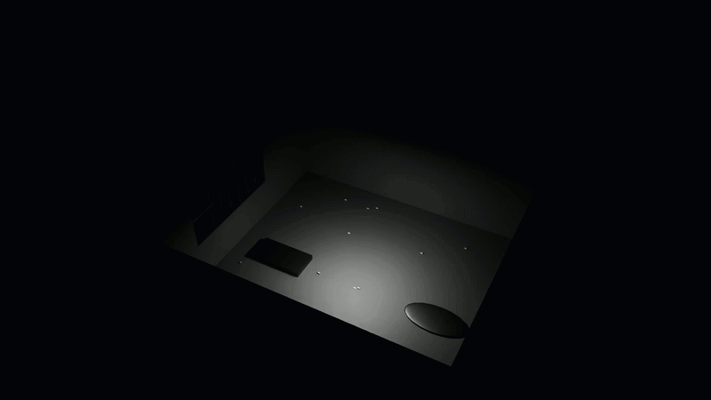

# Blackwood Sanatorium: A USD Environmental Study

<p align="center">
  
</p>

A cinematic, high-tension horror environment built entirely using the **Universal Scene Description (USD)** framework. This project demonstrates a modular "layers and opinions" workflow, procedural light animation, and variant-based asset management optimized for **NVIDIA Omniverse**.

---

## Project Highlights

*   **Non-Destructive USD Pipeline**: Organized into logical layers (`architecture.usda`, `props.usda`, `lighting.usda`) composed into a `main.usda` stage.
*   **Procedural Horror Lighting**: A Python-driven lighting system featuring a 4-phase atmospheric sequence:
    1.  **Normal Rhythmic Flicker**: Establishing the unstable environment.
    2.  **The "Dying Breath"**: High-frequency, single-frame jittering simulating a critical electrical short-circuit.
    3.  **Total Blackout**: A 15-frame period of complete sensory deprivation.
    4.  **The Red Surge**: High-intensity emergency lighting that reveals the room's metallic textures and pharmaceutical scatter.
*   **Component-Based Architecture**: Custom-built window framing with distributed vertical bars and a central structural horizontal bar designed to cast dramatic "cross-hair" shadows across the linoleum floor.
*   **Hinged Door System**: Utilizing a custom pivot-point Xform and time-sampled rotation logic to simulate a heavy, swinging entrance.

---

## Featured Assets

### The Clinical Bed (Multi-State Variants)
The scene features high-detail surgical beds that utilize **USD VariantSets**. This allows the environment to switch between two distinct narrative states instantly without changing geometry:
*   **`clean`**: A sterile, operational look using medical-grade `Surgical_Steel`.
*   **`abandoned`**: A weathered, corroded version with increased roughness and grime, suggesting years of neglect.

### Procedural Pharmaceutical Scatter
To populate the room with micro-detail, I developed a scattering script that instances over 100 **Pill Prototypes**.
*   **Performance**: Uses the `UsdGeom.PointInstancer` for high-efficiency rendering.
*   **LookDev**: Applied a high-gloss `Pill_Plastic` material specifically tuned to catch specular highlights during the "Red Surge" sequence.

---

## How to Run

This project is designed to be built procedurally via the provided Python API scripts.

1.  **Clone the repository** to your local USD-enabled environment.
2.  **Generate the Stage**: Run the master build script to assemble the sub-layers:
    ```bash
    python build_all.py
    ```
3.  **Open the Scene**:
    *   Launch **NVIDIA Omniverse USD Composer**.
    *   Open `data/main.usda`.
4.  **Experience the Narrative**: Hit the **Play** button on the timeline to witness the 100-frame lighting and door animation sequence.

---

## Technical Stack

| Category | Technology |
| :--- | :--- |
| **Core Framework** | Pixar Universal Scene Description (USD) |
| **Language** | Python 3.x (pxr library) |
| **Platform** | NVIDIA Omniverse / RTX Real-Time Renderer |
| **Math** | Gf (Graphics Foundations) for 3D transformations |

---

*Developed as a study in procedural environment assembly and cinematic lighting in USD.*
